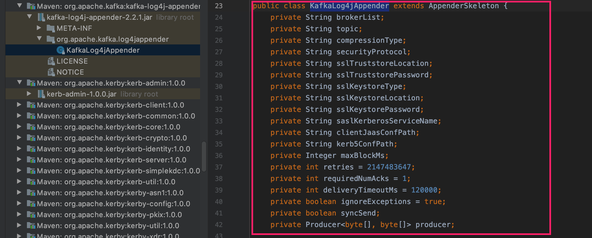

# Spark Kafka Log4j Appender Example

This project demonstrates the how to integrate Spark with KafkaLog4jAppender.

## Test the code using Spark submit

### Step1: Create the Kafka topic `spark_kafka_log4j_topic`

```sh
$ kafka-topics --create --bootstrap-server `hostname -f`:9092 --replication-factor 1 --partitions 3 --topic spark_kafka_log4j_topic
$ kafka-topics --list --bootstrap-server `hostname -f`:9092
```

### Step2: Creating the custom log4j configuration

`vi /tmp/spark-log4j.properties`

```properties
# Root logger option
log4j.rootLogger=WARN,console

# Redirect log messages to console
log4j.appender.console=org.apache.log4j.ConsoleAppender
log4j.appender.console.target=System.err
log4j.appender.console.layout=org.apache.log4j.PatternLayout
log4j.appender.console.layout.ConversionPattern=%d{yyyy/MM/dd HH:mm:ss} %-5p %c{1}:%L %m%n

# Redirect log messages to kafka
log4j.appender.KAFKA=org.apache.kafka.log4jappender.KafkaLog4jAppender
log4j.appender.KAFKA.brokerList=kafka1:9092,kafka2:9092,kafka:9092
log4j.appender.KAFKA.topic=spark_kafka_log4j_topic
log4j.appender.KAFKA.layout=org.apache.log4j.PatternLayout
log4j.appender.KAFKA.syncSend=true
log4j.appender.KAFKA.securityProtocol=PLAINTEXT
log4j.appender.KAFKA.RequiredNumAcks=-1
log4j.appender.KAFKA.ignoreExceptions=false
log4j.appender.KAFKA.layout.ConversionPattern=%d{yyyy/MM/dd HH:mm:ss} %-5p %c{1}:%L %m%n
log4j.logger.kafkaLogger=INFO, KAFKA

# Remove spark log4j appender logs from regular console logger
log4j.additivity.com.ranga=false
log4j.logger.com.ranga=INFO
```

>  Update the Kafka brokers according your cluster configuration. For example, localhost:9092

```sh
log4j.appender.KAFKA.brokerList=localhost:9092
```

The configuration item `log4j.appender.KAFKA.*` matches the variable name in the figure


   
> In spark-log4j.properties, don't add KAFKA appender to rootLoger. It will throw the **org.apache.kafka.common.errors.TimeoutException: Topic spark_kafka_log4j_topic not present in metadata after 60000 ms** error.

### Step3: Download the project

```sh
git clone https://github.com/rangareddy/spark-kafka-log4j-appender-example.git
cd /root/spark-kafka-log4j-appender-example
```

### Step4: Update the spark and kafka dependencies in pom.xml. 

In my case spark version is 2.4.7.7.1.7.1000-141 and kafka version is 2.5.0.7.1.7.1000-141

```shell
<spark.version>2.4.7.7.1.7.1000-141</spark.version>
<kafka.version>2.5.0.7.1.7.1000-141</kafka.version>
```

### Step5: Build the project

```sh
mvn clean package -DskipTests
```

### Step6: Copy the jar file to edge node temporary location.

```sh
scp target/spark-kafka-log4j-appender-example-1.0.0-SNAPSHOT.jar root@hostname:/tmp
```

### Step7: Submit the Spark Application

Copy the `kafka-log4j-appender.jar` to each machine in the cluster.

```sh
cp /opt/cloudera/parcels/CDH/jars/kafka-log4j-appender-2.5.0.7.1.7.1000-141.jar /opt/cloudera/parcels/CDH/lib/spark/jars/
```

#### 1. Client Mode

```sh
spark-submit \
    --master yarn \
    --deploy-mode client \
    --class com.ranga.SparkKafkaLog4jAppenderApp \
    --files /tmp/spark-log4j.properties  \
    --driver-java-options "-Dlog4j.configuration=/tmp/spark-log4j.properties -verbose:class" \
    --conf spark.executor.extraJavaOptions="-Dlog4j.configuration=spark-log4j.properties -verbose:class" \
    /tmp/spark-kafka-log4j-appender-example-1.0.0-SNAPSHOT.jar
```

#### 2. Cluster Mode

```shell
spark-submit \
    --master yarn \
    --deploy-mode cluster \
    --class com.ranga.SparkKafkaLog4jAppenderApp \
    --files /tmp/spark-log4j.properties  \
    --conf spark.driver.extraJavaOptions="-Dlog4j.configuration=spark-log4j.properties -verbose:class" \
    --conf spark.executor.extraJavaOptions="-Dlog4j.configuration=spark-log4j.properties -verbose:class" \
    /tmp/spark-kafka-log4j-appender-example-1.0.0-SNAPSHOT.jar
```

**Output:** 

You will see similar to following output

```shell
2022/11/08 12:47:18 INFO  kafkaLogger:19 SparkSession created successfully

2022/11/08 16:01:43 INFO  kafkaLogger:17 SparkSession created successfully

2022/11/08 16:10:37 INFO  kafkaLogger:20 Spark count value : 100
```

### Step8: Verify the log messages are written to Kafka topic `spark_kafka_log4j_topic`

```sh
$ kafka-console-consumer --bootstrap-server `hostname -f`:9092 --topic spark_kafka_log4j_topic --from-beginning
```

## Test the code from local

### Step1: 

In pom.xml update the `kafka, spark` version according to your cluster and update the scope to `compile`.

### Step2: 

In update th brokerList in log4j.properties (src/main/resources/log4j.properties)

### Step3: 

Run the following code to produce the Kafka messages

```sh
java -jar target/spark-kafka-log4j-appender-example-1.0.0-SNAPSHOT.jar com.ranga.SparkKafkaLog4jAppenderApp
```

### Step4: 

Run the following Consumer code to consume Kafka messages

```sh
java -jar target/spark-kafka-log4j-appender-example-1.0.0-SNAPSHOT.jar com.ranga.consumer.MyKafkaConsumer
```